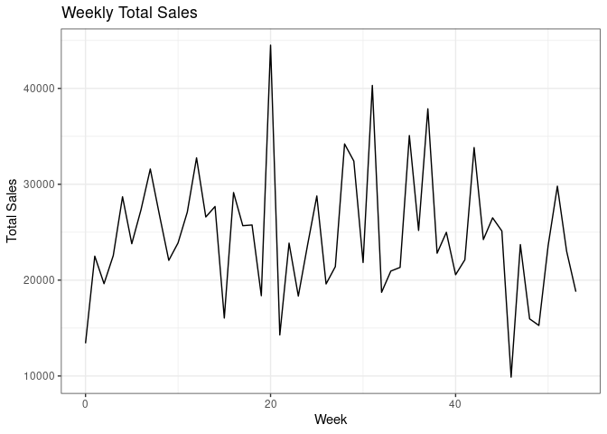
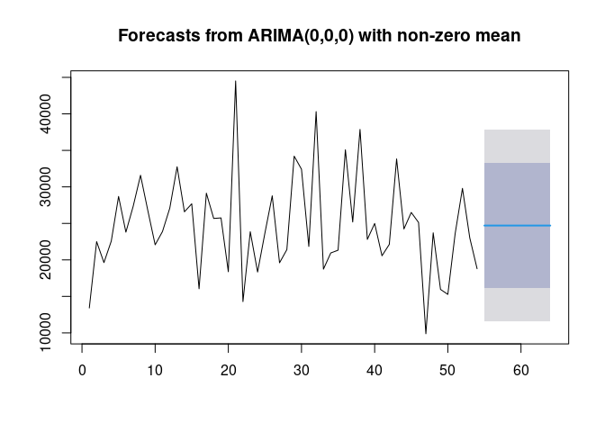
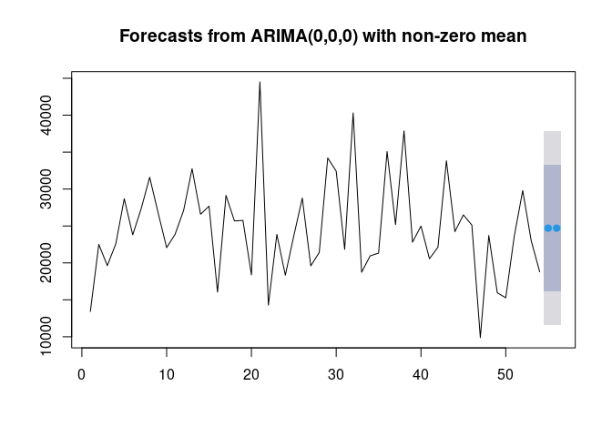

Activity 8 - Mini-competition
================

``` r
library(tidyverse)
```

    ## ── Attaching packages ─────────────────────────────────────── tidyverse 1.3.2 ──
    ## ✔ ggplot2 3.4.1     ✔ purrr   0.3.4
    ## ✔ tibble  3.1.8     ✔ dplyr   1.0.9
    ## ✔ tidyr   1.2.0     ✔ stringr 1.4.1
    ## ✔ readr   2.1.2     ✔ forcats 0.5.2
    ## ── Conflicts ────────────────────────────────────────── tidyverse_conflicts() ──
    ## ✖ dplyr::filter() masks stats::filter()
    ## ✖ dplyr::lag()    masks stats::lag()

``` r
library(forecast)
```

    ## Registered S3 method overwritten by 'quantmod':
    ##   method            from
    ##   as.zoo.data.frame zoo

``` r
data <- read_csv("data/inventory.csv")
```

    ## Rows: 26352 Columns: 3
    ## ── Column specification ────────────────────────────────────────────────────────
    ## Delimiter: ","
    ## chr (1): item_no
    ## dbl (2): week, sold
    ## 
    ## ℹ Use `spec()` to retrieve the full column specification for this data.
    ## ℹ Specify the column types or set `show_col_types = FALSE` to quiet this message.

``` r
weekly_sales <- data %>% select(week, sold) %>% group_by(week) %>% summarise(tsold = sum(sold));
weekly_sales %>% 
  ggplot(aes(x=week, y=tsold)) +
    geom_line() +
    labs(title = 'Weekly Total Sales', x = 'Week', y = 'Total Sales') +
    theme_bw()
```

<!-- -->

``` r
# ARIMA on weekly sales
fit <- auto.arima(weekly_sales$tsold, seasonal = TRUE)
fit
```

    ## Series: weekly_sales$tsold 
    ## ARIMA(0,0,0) with non-zero mean 
    ## 
    ## Coefficients:
    ##             mean
    ##       24701.4074
    ## s.e.    901.7895
    ## 
    ## sigma^2 = 44742714:  log likelihood = -551.76
    ## AIC=1107.52   AICc=1107.76   BIC=1111.5

``` r
prediction <- forecast(fit);
plot(prediction)
```

<!-- -->

``` r
predict_54_55 <- forecast(fit, h=2, level=c(80, 95))
print(predict_54_55)
```

    ##    Point Forecast    Lo 80    Hi 80    Lo 95    Hi 95
    ## 55       24701.41 16129.11 33273.71 11591.21 37811.61
    ## 56       24701.41 16129.11 33273.71 11591.21 37811.61

``` r
plot(predict_54_55)
```

<!-- -->

``` r
# ANN
library(neuralnet)
```

    ## 
    ## Attaching package: 'neuralnet'

    ## The following object is masked from 'package:dplyr':
    ## 
    ##     compute

``` r
items <- data %>% group_by(item_no) %>% distinct(item_no)
items$index <- seq(1, length(items$item_no))
data$item_index = 0;
for(i in 1:nrow(data)) {
  data[i, "item_index"] = items[items$item_no==data$item_no[i], ]$index
}
```

``` r
min_sold = min(data[,"sold"])
max_sold = max(data[,"sold"])
data <- data %>% mutate(sold_norm = ((sold - min_sold) / (max_sold - min_sold)))
train_data <- data %>% filter(week < 52)
test_data <- data %>% filter(week > 51) 
```

``` r
nn <- neuralnet(sold_norm ~ item_index + week, 
                data = train_data, 
                hidden = 5, err.fct = "sse",
                linear.output = FALSE,
                lifesign = 'minimal',
                rep = 2,
                algorithm = "rprop+",
                stepmax = 100000);
```

    ## hidden: 5    thresh: 0.01    rep: 1/2    steps:      61  error: 13.25899 time: 0.35 secs
    ## hidden: 5    thresh: 0.01    rep: 2/2    steps:      30  error: 13.27015 time: 0.16 secs

``` r
nn$result.matrix
```

    ##                                [,1]         [,2]
    ## error                  13.258991975 13.270149085
    ## reached.threshold       0.008877590  0.005187475
    ## steps                  61.000000000 30.000000000
    ## Intercept.to.1layhid1  -0.293031800  0.574987517
    ## item_index.to.1layhid1 -0.212626059 -0.163229971
    ## week.to.1layhid1       -0.328814416 -0.032752545
    ## Intercept.to.1layhid2   1.085125240  1.721848153
    ## item_index.to.1layhid2 -0.200802343 -0.627558304
    ## week.to.1layhid2        0.135324422  0.081953385
    ## Intercept.to.1layhid3   1.252015215  1.006657681
    ## item_index.to.1layhid3  0.849119779 -0.538063561
    ## week.to.1layhid3        1.013070342  0.423602386
    ## Intercept.to.1layhid4  -0.031874188  0.897232067
    ## item_index.to.1layhid4 -0.002283694  1.129708735
    ## week.to.1layhid4       -2.709333427 -0.029400710
    ## Intercept.to.1layhid5   1.259499107 -0.145884148
    ## item_index.to.1layhid5 -0.442265791  0.252114685
    ## week.to.1layhid5        1.072955746 -2.579850885
    ## Intercept.to.sold_norm -3.961647119 -2.849447299
    ## 1layhid1.to.sold_norm  -1.698968554 -1.152235875
    ## 1layhid2.to.sold_norm  -1.220147110 -0.830499450
    ## 1layhid3.to.sold_norm  -0.988905733 -0.415587542
    ## 1layhid4.to.sold_norm  -1.845237567 -2.021223110
    ## 1layhid5.to.sold_norm   0.448810250 -0.113059084

``` r
# Prediction
output <- compute(nn, rep = 2, test_data %>% select(sold_norm, item_index, week))
predicted <- test_data
predicted$predicted_sold_norm = output$net.result
predicted <- predicted %>% 
  mutate(predicted_sold = (predicted_sold_norm * (max_sold - min_sold)) + min_sold)
head(predicted)
```

    ## # A tibble: 6 × 7
    ##   item_no  week  sold item_index sold_norm predicted_sold_norm[,1] predicted_s…¹
    ##   <chr>   <dbl> <dbl>      <dbl>     <dbl>                   <dbl>         <dbl>
    ## 1 020-307    52     0          1         0                 0.00369          26.6
    ## 2 020-307    53     0          1         0                 0.00377          27.1
    ## 3 020-502    52     0          2         0                 0.00248          17.9
    ## 4 020-502    53     0          2         0                 0.00252          18.1
    ## 5 025-207    52     0          3         0                 0.00208          15.0
    ## 6 025-207    53     0          3         0                 0.00210          15.1
    ## # … with abbreviated variable name ¹​predicted_sold[,1]
